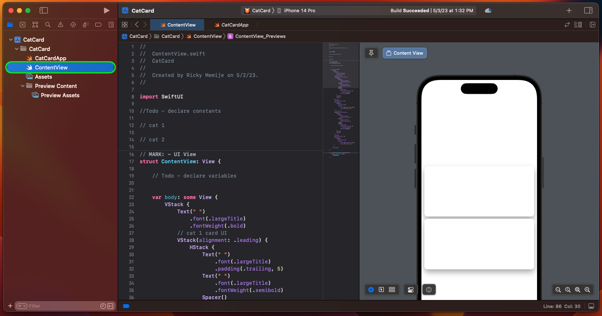

# Cat Card App Hands-On

Having successfully completed **Introduction To Swift**, it's time to apply your newly acquired skills in a practical and engaging manner. Throughout this course, you will be developing an application called "Cat Card" that will enable you to apply and reinforce your understanding of the concepts you've just learned. Get ready to build, experiment, and enhance your coding expertise with the Cat Card project.

## Getting Started with Cat Card

Cat Card is a SwiftUI app designed to showcase information about various cats. By downloading the starter project, you'll embark on an engaging journey of iOS app development.

The starter project comes equipped with the essential UI code, image, and color assets needed to bring your app to life. As you progress through the development of Cat Card, you'll gain invaluable insights into iOS app development lifecycles, builds, and versions, beginning with Build 1.

While the app's UI is an important aspect, the primary focus lies in strengthening your understanding of Swift fundamentals and assembling the building blocks of the app. Rest assured, all necessary UI code and assets will be provided to guide you along the way, allowing you to concentrate on honing your Swift skills and bringing the Cat Card app to life.

### Exploring The Starter Project

Before diving into your project, it's a good practice to familiarize yourself with the various files and their roles within the project. Understanding the structure and purpose of each file will help you navigate and work more efficiently throughout the development process.

In your `Project Navigator`, you will notice the following:

- `Project File`: The main project file, with a .xcodeproj extension, encompasses all essential configurations, target settings, and build settings for your app.

- `CatCard folder`: This directory contains several important files:

   - `CatCardApp.swift`: The main entry point for your SwiftUI app.

    

   - `ContentView.swift`: The file where you define your app's user interface and layout.

   

   - `Assets.xcassets`: A dedicated location for storing assets such as images, app icons, and colors.

   

- `Preview Content folder`: This directory houses resources used for generating previews within the Xcode environment, such as sample images or data.

---

## Build 1

In Build 1 of the Cat Card project, you will apply the concepts you have learned, such as using variables, constants, and different data types. You will utilize these building blocks to create and store various values related to the Cat Card. After defining these values, you will display them in a user interface (UI) to provide a visual representation of the Cat Card. This hands-on experience will help solidify your understanding of fundamental Swift programming concepts and how to integrate them into a real-world iOS app project.

### Builds

In iOS development, **builds** refer to the process of compiling and packaging your application's source code, assets, and resources into an executable file that can be run on an iOS device or simulator.

in your Project File under General under the Identity section you will find essential information about your app, such as the display name, bundle identifier, version, and build number.

- Display Name: The user-facing name of your app as it appears on the device's home screen and within system settings. It should be short and descriptive.
- Bundle Identifier: A unique identifier for your app in reverse domain name notation (e.g., com.company.AppName). This identifier is used by the iOS system to distinguish your app from others on the device and the App Store.
- Version: The user-facing version number of your app (e.g., 1.0.0), which follows a "Major.Minor.Patch" format. Update this value when you release new features, bug fixes, or other updates.
- Build: The internal version number of your app (e.g., 1 or 1.0.0.1), used for tracking different builds during development and testing. Increment this value for each new build, even if it's not submitted to the App Store.

These fields play a crucial role in managing your app's identity and versioning throughout the development process. Throughout this course, you will be creating different builds of the same project, with each build improving as you learn more about Swift building blocks and applying them to the project. This process will enhance your code and the functionality of the app, allowing you to develop a more refined and feature-rich application.

### Instructions

Let's get started! Follow the instructions below:

1. Open the ContentView.swift file.

2. Before the comment `// cat 1`, **declare a `constant` named `appTitle` with a String value of `"Cat Card"`**.

3. Under the comment `// cat 1`, declare the following constants:
   - **Declare a `constant` named `catType1` with a String value of `"Lion"`**.
   - **Declare a `constant` named `catType1Description` with a Multiline String value as follows: `"""
Lions are the only big cats that live in social groups called prides, which can consist of up to 30 individuals working together to hunt and protect their territory. Interestingly, lionesses are the primary hunters of the pride, showcasing impressive teamwork and strategy to take down prey much larger than themselves.
"""`**.
   - **Declare a `constant` named `catType1Number` with a Int value of `1`**.

4. Under the comment `// cat 2`, declare the following constants:
   - **Declare a `constant` named `catType2` with a String value of `"Bobcat"`**.
   - **Declare a `constant` named `catType2Description` with a Multiline String value as follows: `"""
Bobcats are known to be incredibly adaptable predators, thriving in diverse habitats ranging from forests and swamps to deserts and even urban areas. Interestingly, these elusive felines are also exceptional climbers, often leaping up to 12 feet in a single bound to ambush their prey or escape from danger.
"""`**.
   - **Declare a `constant` named `catType2Number` with a Int value of `2`**.

7. Your code should look like the screenshot below:

6. In the `ContentView` struct, declare variables that reference the constants you just created. Under the comment `// Todo - declare variables`, declare the following variables:
   - **Declare the variable `title` and assign it the value of the constant `appTitle`**.
   - **Declare the variable `cat1Name` and assign it the value of the constant `catType1`**.
   - **Declare the variable `cat1Number` and assign it the value of the constant `catType1Number`**.
   - **Declare the variable `cat1Info` and assign it the value of the constant `catType1Description`**.
   - **Declare the variable `cat1Photo` and assign it the string value `"lion"`**.
   - **Declare the variable `cat2Name` and assign it the value of the constant `catType2`**.
   - **Declare the variable `cat2Number` and assign it the value of the constant `catType2Number`**.
   - **Declare the variable `cat2Info` and assign it the value of the constant `catType2Description`**.
   - **Declare the variable `cat1Photo` and assign it the string value `"bobcat"`**.

8. Your code should look like the screenshot below:

Now that you have declared your constants and variables, it's time to integrate them into the provided SwiftUI code. Follow these instructions to transform the given SwiftUI code:

1. Inside your `ContentView` struct's `body` property, replace the placeholder text in the `Text(" ")` view with the variable `title` by updating the line to `Text(title)`. This will display the app's title.

2. Under the comment `// cat 1 card UI`, in the VStack replace the following:
   - Replace the placeholder text in the `Text(" ")` view within the `HStack` with the variable `cat1Number` surrounded by a string interpolation: `Text("\(cat1Number)")`.
   - Replace the second placeholder text in the same `HStack` with the variable `cat1Name`: `Text(cat1Name)`.
   - Replace the placeholder text in the `Image(" ")` view with the variable `cat1Photo`: `Image(cat1Photo)`.
   - Replace the placeholder text in the `Text(" ")` view below the `HStack` with the variable `cat1Info`: `Text(cat1Info)`.

3. Your code should look like the screenshot below:

4. Under the comment `// cat 2 card UI`, in the VStack replace the following:
   - Replace the placeholder text in the `Text(" ")` view within the `HStack` with the variable `cat2Number` surrounded by a string interpolation: `Text("\(cat2Number)")`.
   - Replace the second placeholder text in the same `HStack` with the variable `cat2Name`: `Text(cat2Name)`.
   - Replace the placeholder text in the `Image(" ")` view with the variable `cat2Photo`: `Image(cat2Photo)`.
   - Replace the placeholder text in the `Text(" ")` view below the `HStack` with the variable `cat2Info`: `Text(cat2Info)`.

5. Your code should look like the screenshot below:

Upon completing these steps, the provided SwiftUI code will be transformed into the desired code, showcasing the app's title and information about both cat types. Now, go ahead and build and run the app on the simulator to see the results.

---
